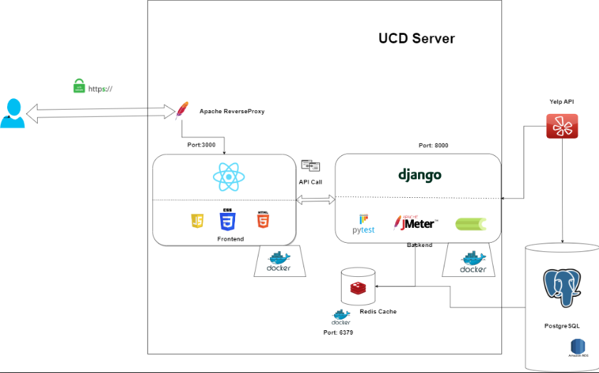
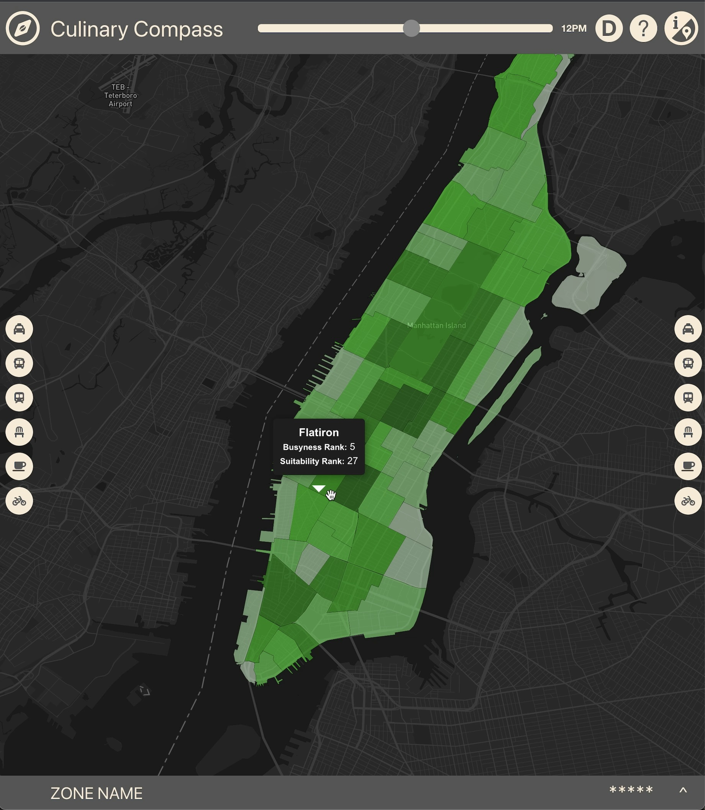
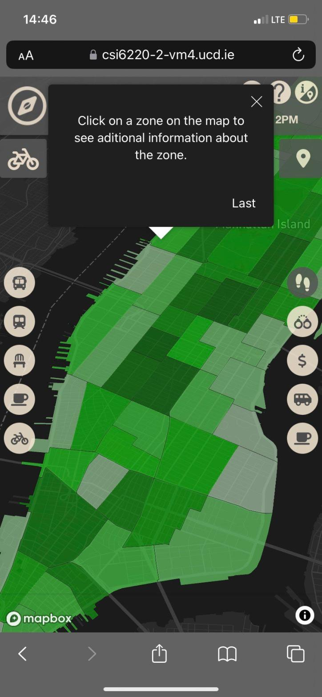

# Coffee Compass MSc Research Practicum

## Overview of the Project
- Coffee Compass, our web-based data analytics application developed for the MSc Research Practicum, offers predictive insights into busyness levels across Manhattan. Its primary aim is to assist prospective cafe owners in making informed decisions when deciding where to locate their cafe.
- Utilised XGBoost machine learning model trained on open-source transport data to predict daily, weekly, and monthly busyness levels.
- Integrated diverse datasets including cafe density, crime rates, property prices, and transit links for comprehensive decision support.
- Designed an intuitive map-based interface using React, Mapbox, and Chart.js to effectively convey data insights.
- Incorporated Yelp API to provide users with reviews and listings of existing cafes for market analysis.
- Engineered the back-end using Django, Redis Cache, and PostgresSQL database to efficiently manage predictions and cafe data.
- Implemented automated caching using Redis, Celery, and Celery Beat to optimise performance and minimise redundant API calls.
- Conducted testing using Selenium, JMeter, Lighthosue, and Pytest to ensure application functionality and reliability.
- Deployed the application on a UCD virtual machine usng Docker and an Apache HTTP server.
- Group members: Cormac Egan, Maximilian Girt, Yuntao Wei, Colmán Larkin, Zhan Li, Nicholas Hegarty
- The full report can be read [here](main/MSc_Research_Practicum_Report.pdf)

## Architecture & UI

Overview of the System Architecture

Desktop View of the UI

Mobile View of the UI

## How to run the project

Steps:
To access our website you can use the link https://csi6220-2-vm4.ucd.ie/# (Update: the VM has since been shutdown as the project has been graded)

Alternatively, if you wish to run the website locally you can clone our repository (ensuring that you work off of main). 

It is recommended that you create an anaconda environment and use the requirements.txt file to install the necessary modules to run the python backend. 

To install the necessary frontend packages you will have to use node packet manager (npm) in COMP47360RearchPracticum_Project/coffee-compass, running npm install will install the neccessary packages as detailed in package.json and package-lock.json

Currently the code is configured on main so that it connects to the __endpoints on the server__. This means you will solely be running the __frontend__ locally. In order to do this you must open up terminal and navigate to the folder called “coffee-compass” (COMP47360RearchPracticum_Project/coffee-compass) and run npm start. This will launch the local development server on http://localhost:3000

Should you wish to run the backend locally you must 
1. Install redis and redis-stack (this will be used for caching)
2. Create a postgresql db populating it with predictions and cafe data. This is done by:
    1. Going to COMP47360RearchPracticum_Project/backend in terminal and running 
        1. python manage.py makemigrations
        2. python manage.py migrate
    2. Running the code in the jupyter notebook “using_predictions.ipynb” to populate the predictions table
    3. Going to COMP47360RearchPracticum_Project/backend in terminal and running manage.py populate_aggregated_predictions
3. Change the code in settings.py to use the local redis server
4. Change the code in settings.py to use the local postgresql db rather than the AWS RDS
5. Change the code in store.js to use the locally hosted api endpoints (rather than the endpoints hosted on the ucd server)
6. Create 2 terminal tabs
    1. In the first go to COMP47360RearchPracticum_Project/backend and run “python manage.py runserver”. This will start the django development server on http://127.0.0.1:8000
    2. In the second again go to COMP47360RearchPracticum_Project/backend and run redis-stack-server. This will launch the redis stack server to enable caching on the website

If you complete these steps you should now be running both the backend and the frontend of the website locally!
